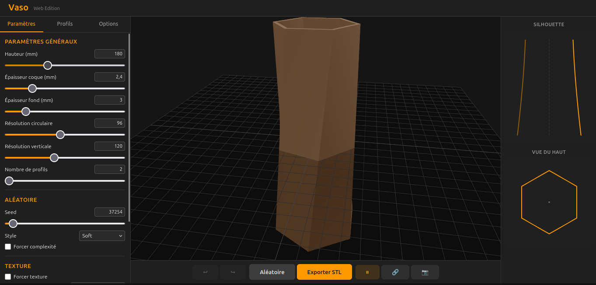
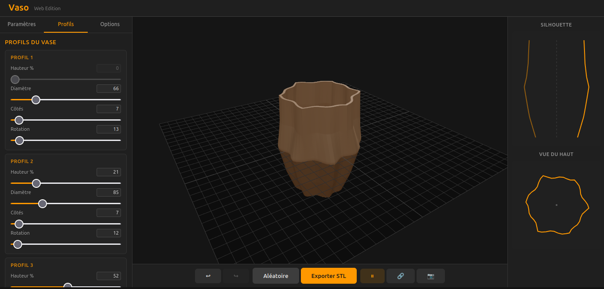
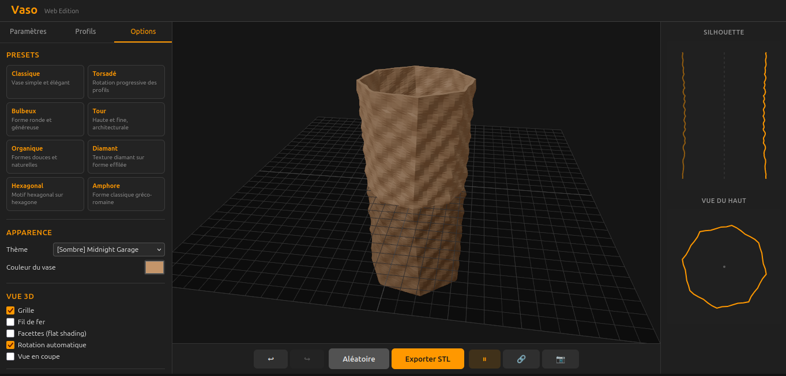

# Vaso Web

**Vaso Web** est un générateur de vases polygonaux accessible directement dans le navigateur.

Il permet de créer des vases à partir de profils polygonaux interpolés verticalement, de générer un maillage 3D, puis d’exporter le modèle au format **STL** pour l’impression 3D.

Version web du projet **Vaso** (application Python Tkinter).

---

## 🌐 Accès en ligne

👉 https://mrklm.github.io/vaso-web/

Aucune installation requise — fonctionne directement dans le navigateur.

---

## 👁️ Aperçu

  
  


---

## ✨ Fonctionnalités

- définition de **2 à 10 profils polygonaux**
- réglage pour chaque profil :
  - diamètre
  - nombre de côtés
  - rotation
  - position verticale
- panneau **Paramètres généraux** :
  - hauteur du vase
  - nombre de profils
  - seed
  - style aléatoire
  - complexité
  - textures et zooms
- panneau **Options** :
  - apparence et thème
  - vue 3D
  - volume imprimante
  - paramètres STL avancés
  - presets
- interpolation entre profils
- génération d’un **maillage 3D**
- export en **STL**
- texte additif sur le fond du vase exporté :
  - version de l’application
  - numéro de seed sur 8 chiffres
  - suffixe `M` si le vase a été modifié manuellement après génération
- textures paramétriques
- génération **aléatoire contrôlée**
- aperçu **temps réel**
- capture d’écran avec bandeau d’information
- contrôle du volume d’impression selon le profil d’imprimante choisi
- interface web moderne (**React**)

---

## 🎲 Génération aléatoire

Vaso Web permet de générer automatiquement des formes variées.

Paramètres disponibles :

- **style de génération**
- **niveau de complexité**
  - sobre
  - moyen
  - complexe
- **texture**
- **zoom de texture**

La génération utilise une **seed** permettant de reproduire une forme identique.

Si l’utilisateur modifie manuellement un vase après génération, la seed affichée reste la même mais reçoit un suffixe `M` :

- dans l’aperçu 3D
- dans le texte additif du STL
- sur le bandeau de la capture d’écran

Ce suffixe indique que la forme courante n’est plus un résultat "pur seed".

---

## 🧱 Architecture du projet

```text
vaso-web
├─ src/
│ ├─ components/
│ ├─ engine/
│ ├─ hooks/
│ ├─ store/
│ ├─ data/
│ └─ themes/
├─ public/
├─ screenshots/
├─ electron/
├─ index.html
├─ package.json
├─ vite.config.ts
└─ README.md
```


---

## 🧪 Installation (développement)

## 1. Cloner le projet

```bash
git clone https://github.com/mrklm/vaso-web.git
cd vaso-web
```

## 2. Installer les dépendances

```bash
npm install
```

## 3. Lancer en mode développement

```bash
npm run dev
```

Puis ouvrir :

`http://localhost:5173`

## 4. Build production

```bash
npm run build
```

Génère :

`dist/`

## 🔄 Déploiement

Le site est automatiquement déployé via GitHub Actions sur GitHub Pages.

Chaque push sur main déclenche :

- build du projet
- publication de `dist/`
- mise à jour du site en ligne

## 🧠 Technologies utilisées

- React
- Vite
- JavaScript / TypeScript
- Three.js / React Three Fiber
- Zustand
- Electron pour la version desktop/export natif

## 🔗 Lien avec la version Python

- 🐍 Vaso (desktop)  
  https://github.com/mrklm/vaso
- 🌐 Vaso Web (ce projet)  
  version navigateur, sans installation, avec export STL et aperçu 3D temps réel

## 📜 Licence

Projet open source distribué sous licence **GNU GPL v3**.

Voir le fichier [LICENSE](LICENSE).

## 💡 Pourquoi ce projet est-il sous licence libre ?

Ce projet s'inscrit dans la philosophie du logiciel libre, promue par des 
associations comme [April](https://www.april.org/). 

Le partage des connaissances et des outils est essentiel
pour une société numérique plus juste et transparente.

---

## 📬 Contact:

clementmorel@free.fr
